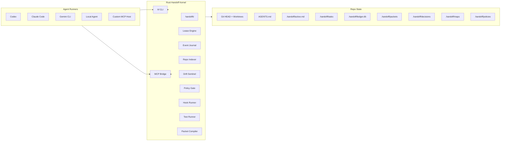
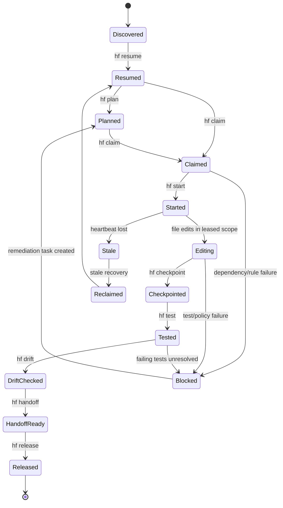

# Handoff Ledger - PRD V2

## 1. Verified Technical Basis

This design is intentionally narrow and current-year grounded.

- Rust stable basis: Rust 1.96.0 was announced May 28, 2026 on the official Rust blog.
- Cargo workspace basis: Cargo workspaces are designed to manage multiple related packages together with shared lockfile/output behavior and shared workspace metadata.
- Rust 2024 resolver basis: Rust 2024 implies Cargo resolver 3, which makes dependency resolution Rust-version-aware.
- Codex agent ergonomics basis: Official Codex guidance emphasizes durable `AGENTS.md`, scoped goals, constraints, done criteria, testing, MCP, skills, and automations.
- Codex subagent basis: Codex can spawn specialized subagents in parallel, but only when explicitly requested, and subagent workflows cost more tokens.
- Codex hook/config basis: Project-scoped `.codex/config.toml` and hooks are supported only when the project is trusted; project configs cannot override sensitive provider/auth settings.
- MCP basis: MCP servers expose tools and resources to AI applications over standardized protocol interfaces, and the official MCP repo contains the specification, schema, and documentation.

Sources are listed in Appendix A.

## 2. Product Decision

Build **Handoff Ledger**: a Rust-native, repo-local handoff kernel for AI coding agents.

The handoff system does not manage model providers. It does not own agent identity outside the repo. It does not attempt to become the AI runtime.

It owns one thing:

> Durable, conflict-safe, drift-resistant project state that any agent can resume from.

## 3. Hard Product Standard

A new agent must be able to enter the repo, run:

```bash
hf resume
```

And immediately know:

1. What the project is.
2. What the active objective is.
3. What was completed.
4. What remains.
5. What task is safe to claim.
6. What files are safe to edit.
7. What tests prove progress.
8. What policy gates apply.
9. What command to run next.

No human explanation. No chat archaeology. No guessing.

## 4. Non-Negotiable Architecture Principles

### 4.1 Repo is the memory

No hidden chat memory is authoritative.

The repo must contain the project memory in durable files and a replayable ledger.

### 4.2 Git is the physical state

The actual code state is Git HEAD plus working tree diff.

### 4.3 Ledger is the operational state

Task claims, leases, checkpoints, tests, and handoffs are events.

### 4.4 Handoff packet is a compiled view

The packet is not the source of truth. It is a readable projection compiled from Git, task cards, ledger events, and policy state.

### 4.5 Agents must be bounded

Every write-capable agent must have:

- an identity
- a task
- a path scope
- a branch
- a worktree
- a lease
- acceptance criteria
- test commands

### 4.6 Parallelism must be admitted, not assumed

Parallel read agents are safe.

Parallel write agents are safe only when path scopes are disjoint and actively leased.

### 4.7 Completion must be evidence-backed

No task is done without:

- changed files summary
- command log
- test evidence or waiver
- acceptance criteria mapping
- drift audit
- handoff packet

## 5. State Precedence Model

When state conflicts, use this order:

1. Git HEAD, branch, worktree diff, and file contents.
2. `.handoff/ledger.db` event stream.
3. `.handoff/tasks/**/*.task.yaml` task cards.
4. `.handoff/decisions/*.adr.md` decision records.
5. `.handoff/active.md` generated active state.
6. `.handoff/packets/latest.md` compiled handoff packet.
7. `docs/AGENT_NAVIGATION.md` generated navigation docs.
8. `AGENTS.md` durable instructions.
9. Chat transcript, if available, as non-authoritative background only.

If a lower-precedence source disagrees with a higher-precedence source, the agent must run:

```bash
hf reconcile
```

## 6. System Architecture



## 7. Rust Toolchain Contract

### 7.1 Toolchain

`rust-toolchain.toml`:

```toml
[toolchain]
channel = "1.96.0"
components = ["rustfmt", "clippy", "rust-src"]
profile = "default"
```

### 7.2 Workspace

Root `Cargo.toml`:

```toml
[workspace]
resolver = "3"
members = [
  "crates/handoff-core",
  "crates/handoff-cli",
  "crates/handoff-daemon",
  "crates/handoff-git",
  "crates/handoff-index",
  "crates/handoff-ledger",
  "crates/handoff-policy",
  "crates/handoff-hooks",
  "crates/handoff-drift",
  "crates/handoff-test",
  "crates/handoff-mcp",
  "crates/xtask"
]

[workspace.package]
edition = "2024"
rust-version = "1.96"
license = "Apache-2.0 OR MIT"

[workspace.lints.rust]
unsafe_code = "forbid"

[workspace.lints.clippy]
unwrap_used = "deny"
expect_used = "deny"
panic = "deny"
todo = "deny"
unimplemented = "deny"
```

### 7.3 Recommended crates

| Need | Recommended Rust crate family |
|---|---|
| CLI | `clap` |
| serialization | `serde`, `serde_json`, `serde_yaml`, `toml` |
| errors | `thiserror`, `anyhow` only at binary boundary |
| logging | `tracing`, `tracing-subscriber` |
| async daemon | `tokio` |
| embedded ledger | `rusqlite` or `sqlx` with SQLite |
| file locks | `fs4` |
| Git | `gix` preferred, `git2` acceptable |
| path walking | `ignore`, `walkdir` |
| glob matching | `globset` |
| graph/DAG | `petgraph` |
| hashing | `blake3`, `sha2` |
| schema generation | `schemars` |
| schema validation | `jsonschema` |
| testing | `tempfile`, `assert_cmd`, `insta`, `proptest` |

## 8. Repo Layout Contract

```text
repo/
|-- AGENTS.md
|-- Cargo.toml
|-- rust-toolchain.toml
|-- crates/
|   |-- handoff-core/
|   |-- handoff-cli/
|   |-- handoff-daemon/
|   |-- handoff-git/
|   |-- handoff-index/
|   |-- handoff-ledger/
|   |-- handoff-policy/
|   |-- handoff-hooks/
|   |-- handoff-drift/
|   |-- handoff-test/
|   |-- handoff-mcp/
|   `-- xtask/
|-- .handoff/
|   |-- ledger.db
|   |-- active.md
|   |-- context/
|   |   |-- northstar.md
|   |   |-- objective.md
|   |   |-- glossary.md
|   |   `-- constraints.md
|   |-- decisions/
|   |-- maps/
|   |   |-- repo-map.json
|   |   |-- test-map.json
|   |   |-- owner-map.json
|   |   `-- dependency-map.json
|   |-- tasks/
|   |   |-- backlog/
|   |   |-- active/
|   |   |-- blocked/
|   |   `-- done/
|   |-- sessions/
|   |-- packets/
|   |   |-- latest.md
|   |   `-- archive/
|   |-- policies/
|   |   |-- rules.toml
|   |   |-- permissions.toml
|   |   `-- drift.toml
|   |-- hooks/
|   |-- skills/
|   `-- agents/
`-- docs/
    |-- AGENT_NAVIGATION.md
    |-- HANDOFF_PROTOCOL.md
    |-- TASK_RULES.md
    |-- DRIFT_CONTROL.md
    `-- TEST_MATRIX.md
```

## 9. Command Contract

| Command | Purpose | Must be idempotent? |
|---|---|---:|
| `hf init` | Create `.handoff` structure and templates | Yes |
| `hf index` | Generate maps and navigation docs | Yes |
| `hf status` | Show repo/ledger/task state | Yes |
| `hf resume` | Print human-readable resume packet | Yes |
| `hf resume --json` | Print machine-readable resume packet | Yes |
| `hf plan` | Create or refresh task DAG | Yes, with reconciliation |
| `hf claim --next` | Atomically claim highest safe task | No, transactional |
| `hf claim TASK-ID` | Claim specific task | No, transactional |
| `hf start` | Create branch and worktree for active claim | Yes, if already created |
| `hf checkpoint` | Append session event and diff summary | Yes, creates new checkpoint event |
| `hf test` | Run task test matrix | Yes, records each run |
| `hf drift` | Run drift audit | Yes |
| `hf handoff` | Compile latest handoff packet | Yes, archives previous |
| `hf release` | Release claim safely | No, transactional |
| `hf reconcile` | Fix inconsistent lower-precedence state | Yes |
| `hf doctor` | Diagnose repo/handoff health | Yes |
| `hf mcp serve` | Expose MCP tools/resources | Long-running |

## 10. Session State Machine



## 11. Conflict Control

### 11.1 Write admission

A write agent may begin only if all conditions are true:

1. Task exists.
2. Task is not blocked.
3. Path scope is explicit.
4. Path scope does not overlap any active write lease.
5. Agent identity is recorded.
6. Branch/worktree can be created.
7. Policy allows requested operations.

### 11.2 Lease transaction

Lease acquisition must be a single transaction:

```text
BEGIN IMMEDIATE;
  read active leases;
  detect overlap;
  insert lease_requested;
  insert lease_active;
  insert heartbeat;
COMMIT;
```

If any step fails, no lease is granted.

### 11.3 SQLite and file-locking

Use SQLite WAL for the ledger. Add an outer repo-local lock file for high-risk operations:

```text
.handoff/locks/ledger.lock
.handoff/locks/merge.lock
.handoff/locks/index.lock
```

### 11.4 Worktree isolation

Every write session gets:

```text
branch: agent/{task_id}/{agent_id}/{utc_timestamp}
worktree: ../.worktrees/{repo}/{task_id}-{agent_id}
```

### 11.5 Merge serialization

Review may be parallel. Merge is single-writer.

Only the merge steward can hold `merge.lock`.

## 12. Drift Control System

This is the largest V2 upgrade.

### 12.1 Drift definition

Agent drift is any session behavior that moves away from the active objective, task scope, constraints, or completion criteria without an explicit decision record.

Common drift modes:

| Drift mode | Example | Control |
|---|---|---|
| Goal drift | Agent starts redesigning architecture during a bug fix | objective hash + pre-edit gate |
| Scope drift | Agent edits files outside task path scope | path lease gate |
| Completion drift | Agent declares done without tests | handoff gate |
| Context drift | Agent follows stale packet over current Git state | state precedence rule |
| Policy drift | Agent ignores no-Docker/offline constraint | policy gate |
| Swarm drift | Subagent starts parallel write work unsafely | swarm admission control |
| Documentation drift | `AGENTS.md` becomes stale or bloated | generated active state outside AGENTS.md |
| Evidence drift | Agent claims something changed without file/test evidence | evidence ledger |

### 12.2 Intent locks

Every active task receives an intent lock:

```json
{
  "task_id": "TASK-0001",
  "objective_hash": "blake3:...",
  "path_scope_hash": "blake3:...",
  "acceptance_hash": "blake3:...",
  "constraint_hash": "blake3:...",
  "northstar_revision": "ADR-0001"
}
```

Any task mutation changes the hash and creates a `task_intent_changed` event.

### 12.3 Drift sentinel checks

Run before edit, before handoff, and before completion.

Checks:

1. Is current task still active?
2. Did objective hash change?
3. Did path scope change?
4. Did acceptance criteria change?
5. Did repo constraints change?
6. Did agent edit outside path scope?
7. Did tests map to acceptance criteria?
8. Did new work contradict a decision record?
9. Did the agent create undocumented architecture changes?
10. Did the agent update handoff state after material changes?

### 12.4 Drift audit output

```json
{
  "schema": "handoff.drift_report.v1",
  "task_id": "TASK-0001",
  "status": "pass",
  "objective_hash_match": true,
  "path_scope_match": true,
  "acceptance_hash_match": true,
  "out_of_scope_files": [],
  "undocumented_decisions": [],
  "missing_evidence": [],
  "required_actions": []
}
```

### 12.5 Drift rules

Hard fail:

- out-of-scope write
- changed objective without ADR
- completion without tests/waiver
- stale packet contradicts Git/ledger
- parallel write lease overlap

Soft fail:

- docs not updated
- missing decision note
- stale index
- task title no longer matches implementation

Soft fail creates a repair task. Hard fail blocks handoff.

## 13. Context Capsule

A new agent should not read the whole repo first. It should load the context capsule.

File:

```text
.handoff/context/capsule.json
```

Required fields:

```json
{
  "schema": "handoff.context_capsule.v1",
  "project_name": "Ark Handoff Ledger",
  "northstar": "Integrity, reversibility, capability gain.",
  "active_objective": "...",
  "current_task_id": "TASK-0001",
  "repo_map_digest": "blake3:...",
  "latest_packet": ".handoff/packets/latest.md",
  "next_command": "hf claim --next",
  "must_read": [
    "AGENTS.md",
    ".handoff/active.md",
    "docs/AGENT_NAVIGATION.md"
  ],
  "must_not": [
    "edit without claim",
    "skip handoff",
    "parallel write same path"
  ]
}
```

## 14. Handoff Packet V2

The packet must be concise, evidence-backed, and replayable.

### Required sections

1. Project North Star
2. State Precedence Reminder
3. Active Objective
4. Active Task
5. Current Branch and Worktree
6. Claimed Paths
7. Work Completed
8. Files Changed
9. Commands Run
10. Tests Run
11. Drift Audit
12. Decisions Made
13. Risks
14. Blockers
15. Next Best Task
16. Exact Resume Commands
17. Machine-Readable Summary

### Packet machine summary

```json
{
  "schema": "handoff.packet.v2",
  "packet_id": "PKT-20260602-0001",
  "session_id": "...",
  "task_id": "TASK-0001",
  "task_status": "checkpointed",
  "branch": "agent/TASK-0001/agent-a/20260602T170000Z",
  "worktree": "../.worktrees/repo/TASK-0001-agent-a",
  "claimed_paths": [],
  "changed_files": [],
  "commands": [],
  "tests": [],
  "drift_report": {
    "status": "pass",
    "out_of_scope_files": [],
    "missing_evidence": []
  },
  "next_task_id": "TASK-0002",
  "next_command": "hf resume && hf claim TASK-0002 && hf start"
}
```

## 15. Skills

Skills must be short, reusable, and file-backed.

| Skill | Purpose | Allowed mode |
|---|---|---|
| `session-resume` | Rehydrate latest state | read-only |
| `repo-cartographer` | Build repo map | read-only/write generated maps |
| `task-decomposer` | Create task DAG | write `.handoff/tasks` only |
| `claim-and-lease` | Claim safe task | transactional write |
| `implementation` | Perform task edits | write leased paths only |
| `test-repair` | Run and repair tests | write leased paths only |
| `drift-auditor` | Detect objective/scope drift | read-only/write report |
| `handoff-scribe` | Compile packet | write packets/sessions only |
| `merge-steward` | Serialize merge | merge lock required |
| `policy-auditor` | Enforce hard rules | read-only/write violations |

## 16. Sub-Agent

| Sub-agent | Writes? | Required lease? | Failure behavior |
|---|---:|---:|---|
| Root Orchestrator | Task files only | Yes for task mutation | create remediation task |
| Repo Cartographer | Generated maps only | No, index lock only | mark index stale |
| Implementer | Yes | Yes | checkpoint + block task |
| Test Runner | Logs only, unless repair claim exists | Repair requires lease | create repair task |
| Reviewer | No | No | issue review finding |
| Conflict Arbiter | Claims/leases only | Transaction lock | block unsafe claim |
| Drift Auditor | Reports only | No | block handoff on hard fail |
| Handoff Scribe | Packets/sessions only | No | fail closed |
| Merge Steward | Git integration branch | Merge lock | abort merge and preserve branch |

## 17. Agent Swarm

### 17.1 Swarm classes

| Swarm type | Parallel? | Writes? | Admission rule |
|---|---:|---:|---|
| Exploration swarm | Yes | No | read-only |
| Planning swarm | Limited | Task files only | task mutation lock |
| Implementation swarm | Yes | Yes | disjoint path leases only |
| Test swarm | Yes | Logs only | no source writes unless repair claim |
| Review swarm | Yes | No | read-only |
| Merge swarm | No for final merge | Yes | one merge lock |

### 17.2 Swarm safety rule

A swarm cannot self-expand. Expansion requires an orchestrator event:

```text
swarm_expand_requested -> policy_check -> leases_reserved -> agents_started
```

### 17.3 Parallel write example

Allowed:

```text
Agent A: crates/handoff-index/**
Agent B: crates/handoff-hooks/**
Agent C: docs/**
```

Blocked:

```text
Agent A: crates/handoff-core/**
Agent B: crates/handoff-core/types.rs
```

## 18. Hook Contract

Hooks are deterministic lifecycle gates.

### 18.1 Hook payload

```json
{
  "schema": "handoff.hook_event",
  "event": "PreEdit",
  "session_id": "...",
  "agent_id": "...",
  "task_id": "TASK-0001",
  "branch": "...",
  "worktree": "...",
  "claimed_paths": [],
  "target_paths": [],
  "command": null,
  "timestamp": "2026-06-02T17:00:00Z"
}
```

### 18.2 Hook result

```json
{
  "schema": "handoff.hook_result",
  "status": "allow",
  "severity": "info",
  "message": "edit inside claimed scope",
  "required_actions": []
}
```

### 18.3 Required events

| Event | Gate |
|---|---|
| `SessionStart` | load context capsule |
| `SessionResume` | verify state precedence |
| `TaskClaim` | transactionally reserve paths |
| `PreEdit` | block out-of-scope edits |
| `PostEdit` | update journal and dirty file list |
| `PreCommand` | block destructive commands |
| `PostCommand` | record command evidence |
| `PreTest` | resolve test matrix |
| `PostTest` | record result and logs |
| `PreHandoff` | require checkpoint, tests, drift audit |
| `PostHandoff` | archive packet and update active state |
| `SessionStop` | checkpoint and release/renew lease |

## 19. Rules V2

### Hard rules

1. No write without task claim.
2. No claim without explicit path scope.
3. No overlapping active write leases.
4. No merge without merge lock.
5. No task completion without acceptance evidence.
6. No handoff without checkpoint.
7. No handoff without drift audit.
8. No packet as source of truth over Git/ledger.
9. No generated state edited manually unless policy allows.
10. No destructive command without explicit policy allowance.
11. No provider-specific memory as authoritative project state.
12. No swarm self-expansion.
13. No stale lease reuse without recovery event.
14. No dependency addition without dependency-audit event.
15. No architecture change without ADR.

### Soft rules

1. Keep `AGENTS.md` short.
2. Put changing state in `.handoff/active.md`, not `AGENTS.md`.
3. Keep tasks atomic.
4. Keep path scopes narrow.
5. Prefer generated maps over hand-written summaries.
6. Prefer creating repair tasks over vague blocker prose.

## 20. Test Matrix

### 20.1 Unit tests

- task schema parse/serialize
- packet schema parse/serialize
- path glob overlap
- lease transition rules
- hook result interpretation
- drift report classification
- state precedence resolution
- policy gate decisions

### 20.2 Property tests

- random path scopes never allow overlap
- random task DAGs produce legal next task ordering
- random event streams replay to same final state
- random checkpoint interruptions preserve last valid state
- random packet data roundtrips through schema

### 20.3 Integration tests

- `hf init` creates structure
- `hf index` creates maps
- `hf claim --next` claims safe task
- overlapping claim is rejected
- disjoint claim is allowed
- `hf start` creates worktree
- `hf checkpoint` records diff
- `hf test` records command evidence
- `hf drift` blocks out-of-scope edit
- `hf handoff` compiles packet
- `hf resume` works from packet + ledger

### 20.4 Crash tests

- crash during claim
- crash during checkpoint
- crash during handoff packet write
- crash during index update
- daemon killed during heartbeat
- worktree deleted manually
- ledger lock held by dead process
- corrupted task YAML

Expected behavior:

- fail closed
- preserve previous valid state
- create recovery task
- never silently mark done

### 20.5 Drift tests

- edit outside path scope -> hard fail
- objective changed without ADR -> hard fail
- tests skipped without waiver -> hard fail
- packet contradicts ledger -> reconcile required
- task acceptance changed mid-session -> re-claim required
- architecture files changed without ADR -> hard fail

### 20.6 Fresh-agent acceptance test

In a fresh shell with no chat context:

```bash
hf resume --json
```

The JSON must answer:

- project name
- active objective
- current task
- safe next task
- claimed paths
- blocked paths
- required tests
- latest packet
- drift state
- next command

## 21. Implementation Plan V2

### Phase 0 - Bootstrap

Deliver:

- Rust workspace
- `hf` CLI stub
- `xtask`
- `.handoff` skeleton
- root `AGENTS.md`
- schemas
- policy templates

Acceptance:

```bash
cargo fmt --check
cargo clippy --workspace --all-targets -- -D warnings
cargo test --workspace
hf init
hf status
```

### Phase 1 - Ledger and schemas

Deliver:

- SQLite ledger
- event model
- task schema
- packet schema
- session schema
- atomic writes

Acceptance:

- event replay reconstructs active state
- corrupted write does not destroy previous state

### Phase 2 - Claim and lease engine

Deliver:

- path scope matching
- conflict detection
- lease transaction
- heartbeat
- stale recovery

Acceptance:

- overlapping writes blocked
- disjoint writes allowed
- stale leases recoverable

### Phase 3 - Git/worktree engine

Deliver:

- branch creation
- worktree creation
- dirty file detection
- diff digest
- cleanup/reconcile

Acceptance:

- each write session has isolated worktree
- merge is serialized

### Phase 4 - Index and navigation

Deliver:

- repo map
- dependency map
- test map
- owner map
- context capsule
- `docs/AGENT_NAVIGATION.md`

Acceptance:

- new agent can understand repo from generated files

### Phase 5 - Drift sentinel

Deliver:

- objective hash
- task scope hash
- acceptance hash
- drift report
- drift gates

Acceptance:

- out-of-scope edits hard fail
- completion without evidence hard fails

### Phase 6 - Hooks and policy

Deliver:

- hook runner
- hook payload/result schema
- policy TOML
- hard/soft violation classification

Acceptance:

- pre-edit/pre-handoff gates enforce rules

### Phase 7 - Test runner and packet compiler

Deliver:

- task-aware test execution
- command evidence log
- packet V2 compiler
- archive rotation

Acceptance:

- `hf handoff` creates packet with evidence and next command

### Phase 8 - MCP bridge

Deliver:

- MCP tools/resources for status/resume/claim/checkpoint/handoff/repo map
- no provider ownership

Acceptance:

- external agent can resume and claim via MCP

### Phase 9 - Hardening

Deliver:

- crash tests
- concurrency tests
- replay tests
- snapshot tests
- docs
- release binary

Acceptance:

- fresh-agent acceptance test passes

## 22. Backlog V2

| ID | Task | Priority | Path scope | Acceptance |
|---|---|---:|---|---|
| TASK-0001 | Bootstrap Rust workspace | P0 | root, crates, `.handoff` | workspace builds |
| TASK-0002 | Implement schemas | P0 | `crates/handoff-core`, `schemas` | roundtrip tests pass |
| TASK-0003 | Implement ledger | P0 | `crates/handoff-ledger` | replay tests pass |
| TASK-0004 | Implement lease engine | P0 | `crates/handoff-core`, `crates/handoff-ledger` | overlap blocked |
| TASK-0005 | Implement `hf resume` | P0 | CLI, packet, ledger | fresh-agent JSON works |
| TASK-0006 | Implement `hf claim` | P0 | CLI, lease | transactional claim |
| TASK-0007 | Implement worktrees | P0 | `handoff-git` | isolated sessions |
| TASK-0008 | Implement drift sentinel | P0 | `handoff-drift` | hard drift blocked |
| TASK-0009 | Implement packet compiler | P0 | packet module | golden tests pass |
| TASK-0010 | Implement hook runner | P1 | hooks module | gates enforce policy |
| TASK-0011 | Implement repo indexer | P1 | index module | maps generated |
| TASK-0012 | Implement test runner | P1 | test module | evidence recorded |
| TASK-0013 | Implement MCP bridge | P1 | mcp module | external resume works |
| TASK-0014 | Implement doctor/reconcile | P1 | CLI + ledger | corrupted state detected |
| TASK-0015 | Add hardening suite | P1 | tests | crash/concurrency pass |

## 23. First Three Task Cards

### TASK-0001

```yaml
schema: handoff.task.v1
id: TASK-0001
title: Bootstrap Rust-native handoff workspace
status: backlog
priority: P0
objective: >
  Create the initial Rust workspace, hf CLI stub, xtask runner, root AGENTS.md,
  .handoff skeleton, schemas, and policy templates.
path_scope:
  - Cargo.toml
  - rust-toolchain.toml
  - AGENTS.md
  - crates/**
  - .handoff/**
  - docs/**
acceptance_criteria:
  - Workspace uses Rust 2024 edition and resolver 3.
  - hf CLI compiles.
  - hf init is idempotent.
  - .handoff/active.md exists.
  - Root AGENTS.md directs agents to run hf resume first.
test_commands:
  - cargo fmt --check
  - cargo clippy --workspace --all-targets -- -D warnings
  - cargo test --workspace
```

### TASK-0002

```yaml
schema: handoff.task.v1
id: TASK-0002
title: Implement core schemas and type model
status: backlog
priority: P0
objective: >
  Implement task, session, packet, hook, lease, and drift report schemas
  with roundtrip tests.
path_scope:
  - crates/handoff-core/**
  - schemas/**
acceptance_criteria:
  - All schemas serialize and deserialize.
  - JSON Schema is generated or checked in.
  - Invalid task cards fail validation.
  - Snapshot tests cover stable examples.
test_commands:
  - cargo test -p handoff-core
  - cargo test --workspace schema
```

### TASK-0003

```yaml
schema: handoff.task.v1
id: TASK-0003
title: Implement event ledger and replay
status: backlog
priority: P0
objective: >
  Implement append-only session/task/lease event ledger with replayable
  active-state reconstruction.
path_scope:
  - crates/handoff-ledger/**
  - crates/handoff-core/**
acceptance_criteria:
  - Ledger uses SQLite WAL.
  - Event inserts are atomic.
  - Replay reconstructs active task, active claims, latest tests,
    and latest packet pointer.
  - Interrupted writes preserve previous valid state.
test_commands:
  - cargo test -p handoff-ledger
  - cargo test --workspace replay
```

## 24. Final MVP Definition

The MVP is complete when a fresh agent can do this without prior chat context:

```bash
hf init
hf index
hf resume
hf claim --next
hf start
hf checkpoint --note "first checkpoint"
hf test
hf drift
hf handoff
hf resume --json
```

And the system prevents this:

```bash
# Agent A
hf claim TASK-0004

# Agent B
hf claim TASK-0004
# rejected: active lease conflict
```

And this:

```bash
# Agent tries to edit outside scope
hf drift
# hard fail: out_of_scope_files detected
```

## 25. Done Means Done

This system is done only when:

1. The repo itself contains enough state for continuation.
2. The ledger can replay active state.
3. A fresh agent can resume without human help.
4. Parallel write conflicts are blocked.
5. Stale sessions recover safely.
6. Drift is detected before handoff.
7. Every completed task has evidence.
8. Every handoff has exact next commands.
9. MCP integration is optional, not authoritative.
10. The implementation is test-backed.

## Appendix A - Source Notes

- Rust 1.96.0 official release page: https://blog.rust-lang.org/releases/latest/
- Rust blog index showing May 28, 2026 Rust 1.96.0 announcement: https://blog.rust-lang.org/
- Cargo workspaces reference: https://doc.rust-lang.org/cargo/reference/workspaces.html
- Rust 2024 Cargo resolver 3 reference: https://doc.rust-lang.org/edition-guide/rust-2024/cargo-resolver.html
- Codex best practices covering AGENTS.md, MCP, skills, testing, and reusable guidance: https://developers.openai.com/codex/learn/best-practices
- Codex subagents documentation: https://developers.openai.com/codex/subagents
- Codex advanced configuration and hooks documentation: https://developers.openai.com/codex/config-advanced
- MCP server concepts: https://modelcontextprotocol.io/docs/learn/server-concepts
- Official MCP specification/schema/documentation repository: https://github.com/modelcontextprotocol/modelcontextprotocol
